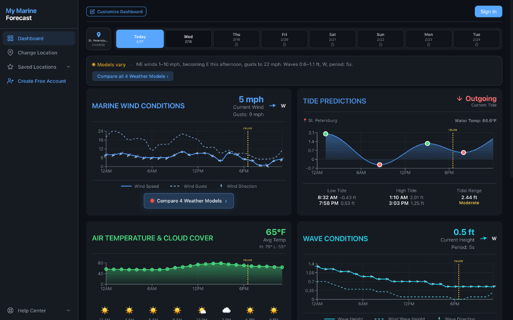

## Minha-Jornada-Pratica-na-Nuvem-AWS
"Do AWS re/Start ao console da AWS: documentando cada clique, cada erro e cada vitória."

Aqui irei registrar a minha jornada prática pelos conceitos fundamentais de computação em nuvem, unindo os aprendizados intensivos do programa **AWS re/start (pela Escola da Nuvem)** com os desafios práticos dos laboratórios do **AWS Skill Builder SimuLearn**.

## Índice dos Laboratórios SimuLearn.  

| Etapa | Laboratório                                                   | Status      | Link                      |
| ----- | ------------------------------------------------------------- | ----------- | ------------------------- |
| 01    | **Fundamentos da computação em nuvem**                        | ✅ Concluído | [Ver detalhes](#etapa-01) |
| 02    | **Primeiros passos na nuvem**                                 | ✅ Concluído | [Ver detalhes](#etapa-02) |
| 03    | **Soluções de computação**                                    | ✅ Concluído | [Ver detalhes](#etapa-03) |
| 04    | **Primeiro banco de dados NoSQL**                             | ✅ Concluído | [Ver detalhes](#etapa-04) |
| 05    | **Conceitos de rede**                                         | ✅ Concluído | [Ver detalhes](#etapa-05) |
| 06    | **Economias na nuvem**                                        | ✅ Concluído | [Ver detalhes](#etapa-06) |
| 07    | **Sistemas de arquivos na nuvem**                             | ✅ Concluído | [Ver detalhes](#etapa-07) |
| 08    | **Banco de dados na prática**                                 | ✅ Concluído | [Ver detalhes](#etapa-08) |
| 09    | **Conceitos básicos de segurança**                            | ✅ Concluído | [Ver detalhes](#etapa-09) |
| 10    | **Aplicações de recuperação automática e com escalabilidade** | ✅ Concluído | [Ver detalhes](#etapa-10) |
| 11    | **Aplicativos web de alta disponibilidade**                   | ✅ Concluído | [Ver detalhes](#etapa-11) |
| 12    | **Conectando VPCs**                                           | ✅ Concluído | [Ver detalhes](#etapa-12) |

<table>
  <tr>
    <td align="center">
       
      <b>Dashboard da Etapa 1</b>
    </td>
    <td align="center">
       
      <b>Arquitetura S3 SimuLearn</b>
    </td>
  </tr>
</table>

A ideia deste espaço não é apenas guardar código ou respostas, mas documentar os bastidores do aprendizado real: os erros no console, os pequenos travamentos, a investigação de mensagens de erro e a satisfação de ver a validação passar com sucesso! 

## Etapa 01: Fundamentos da computação em nuvem

### O Problema
A cidade tinha um portal web de previsão de ondas que vivia fora do ar porque os servidores locais (*on-premises*) não aguentavam o tráfego. Obter e configurar novos recursos de hardware demorava meses. A missão era clara: migrar esse site para o Amazon S3 e transformá-lo numa hospedagem estática rápida, barata e confiável — capaz de lidar com volumes ilimitados de tráfego sem precisar de servidor web tradicional.

### A Solução
Migrar o site estático para a nuvem usando o Amazon S3, aproveitando agilidade, redução de custos e alta disponibilidade.

---

### O que eu aprendi sobre o S3 antes de colocar a mão na massa
No Amazon S3, os dados são armazenados como objetos (arquivos + metadados) dentro de *buckets* (contêineres). Qualquer *bucket* S3 pode ser habilitado pra hospedar um site estático. O *bucket* armazena o arquivo `index.html` e os recursos de suporte (scripts do lado do cliente, folhas de estilo, etc.). O acesso ao *bucket* é controlado por uma política de *bucket* escrita em JSON — ela diz quem pode acessar e o que pode fazer. Quando os moradores acessam o portal, o navegador envia uma solicitação GET pra URL da página estática, que serve o objeto raiz.

### O que foi feito
* Navegação pelo Console da AWS e localização do serviço Amazon S3.
* Compreensão do papel do S3 como armazenamento de objetos e hospedagem estática.
* Análise da arquitetura proposta no cenário do SimuLearn.

### Aprendizados e Bastidores
> *"Achar o S3 no menu gigantesco do console foi quase um desafio por si só! Mas quando vi o diagrama da arquitetura fazendo sentido, deu aquele clique: então É ASSIM que a nuvem funciona na prática!"*

* O Amazon S3 é muito mais do que "armazenamento de arquivos" — é hospedagem, recuperação e entrega de dados num serviço só.
* Na nuvem, você provisiona recursos em minutos, não em meses.
* Segurança é fundamental: a política do *bucket* (*bucket policy*) garante o controle de acesso.

---

### Aqui vai tudo que eu fiz no console, do jeito que rolou:

1. **Encontrando o S3 no console:** Na caixa de pesquisa da barra de navegação superior, digitei `s3`. Nos resultados, em Serviços, cliquei em S3. *Gente, achar o serviço certo naquele menu gigantesco já foi meio desafio — mas quando eu achei, deu aquele alívio!* 😅

2. **Explorando o *bucket*:** Na guia *Buckets* de uso geral, cliquei no nome do *bucket* que começava com `website-bucket-`. Esse *bucket* já continha o código necessário pro laboratório. Na parte superior da página, selecionei e copiei o nome do *bucket* pra colar num editor de texto — porque depois eu ia precisar usar ele na seção DIY.

3. **Conferindo os objetos do site:** Na guia *Objetos*, revisei os arquivos que estavam lá. Cinco arquivos no total — eles continham todo o conteúdo do site estático. Dá pra clicar em *Upload* para adicionar arquivos locais também, mas nesse lab não precisei.

4. **Renomeando o arquivo de erro (Momento de atenção total!):** 
   * Marquei a caixa de seleção do objeto `text.html`.
   * Cliquei em *Ações* para expandir a lista.
   * Escolhi **Renomear objeto**.
   * No campo Nome do novo objeto, digitei: `error.html`.
   * Cliquei em *Salvar alterações*.

* *Esse arquivo é a página de erro que aparece sempre que algo dá errado pros usuários do site. Renomear parece simples, mas na hora dá aquele frio na barriga de "será que eu fiz certo?"*
  
5. **Configurando as permissões:**

* Fui pra aba *Permissões*. Na seção *Block public access (bucket settings)*, confirmei que *Block all public access* estava desativado. ⚠️ *(Desativar isso é necessário pra hospedar sites estáticos pelo S3. Em produção, a gente usa permissões mais restritas — mas no lab, precisava estar aberto).*

* Na janela do editor de política do *bucket*, revisei a política JSON. Ela permite acesso público somente leitura (`GetObject`) pra qualquer pessoa acessar os objetos do *bucket*. Bem tranquilo de entender quando você lê com calma.

6. **Habilitando a hospedagem estática:** 
   * Fui pra aba *Propriedades*, rolei até a seção *Hospedagem de site estático* e cliquei em *Editar*.
   * Hospedagem de site estático: selecionei **Ativar**.
   * Tipo de hospedagem: escolhi **Hospedar um site estático**.
   * Documento de índice: digitei `index.html`.
   * Documento de erro: digitei `error.html`.
   * Salvei e pronto — o *bucket* virou um servidor web!

7. **Testando o site:**

Na seção *Static website hosting*, confirmei que o tipo de hospedagem estava como *Bucket hosting*. Em *Bucket website endpoint*, cliquei no ícone de cópia pra pegar o *endpoint*. Abri uma nova aba do navegador, colei o *endpoint* e pressionei Enter. E lá estava: a página **Beach Wave Conditions** carregando perfeitamente! 

8. **Acessando o Endpoint e Testando o Portal**

Com a hospedagem de site estático habilitada nas propriedades do bucket e o endpoint copiado:
* Abri uma nova aba no navegador, colei o link do endpoint e dei um *Enter*.
* **O resultado:** O portal **Beach Wave Conditions** carregou perfeitamente, mostrando que a migração do site estático para o Amazon S3 foi um sucesso absoluto. A cidade agora tem um site rápido, seguro e capaz de aguentar qualquer volume de tráfego dos moradores!

### Validação Concluída com Sucesso
Para encerrar a tarefa no Skill Builder, voltei para a página de instrução do laboratório, conferi se todos os critérios técnicos exigidos pelo cenário tinham sido cumpridos e submeti a atividade. Ver a tela de parabéns e o selo **"YOU DID IT!"** fechou esse laboratório com chave de ouro! 🎉

### Resumo do que foi feito
* Localizei o serviço Amazon S3 no Console da AWS.
* Explorei o *bucket* e seus objetos.
* Renomeei `text.html` para `error.html`.
* Revisei e confirmei as permissões de acesso público.
* Analisei e apliquei a política de *bucket* em JSON.
* Habilitei a hospedagem de site estático no *bucket*.
* Copiei o *endpoint* e acessei o site no navegador e funcionou sucesso!

### Ver a tela de parabéns e o selo **"YOU DID IT!"** na terceira etapa foi a coroação de todo o processo de investigação e configuração no console da AWS! 🎉

  

## 💡 O que levo dessa experiência?

* **Visão Prática de Resolução de Problemas:** Entender que mensagens de erro no console são aliadas valiosas de governança e segurança.
* **Governança em Nuvem:** Compreender o uso de travas como proteção contra interrupção e encerramento.
* **Gerenciamento de Instâncias EC2:** Domínio sobre alteração de tipos de instâncias, controle de estados (parar, iniciar, executar) e mapeamento de recursos.

## 🏁 A Reta Final: O Teste e a Validação no Console
Depois de configurar toda a parte de infraestrutura e permissões, chegou o momento mais esperado do laboratório: ver o portal de ondas funcionando no ar e fazer a validação final!

## Conclusão da Etapa
Esse laboratório de Fundamentos em Nuvem mostrou na prática que a transição de servidores locais tradicionais para a nuvem traz agilidade imbatível. Em poucos minutos, configuramos armazenamento, política de acesso público em JSON e hospedagem web escalável sem precisar gerenciar um único sistema operacional de servidor web!

## Conecte-se comigo

Se você também é apaixonado(a) por tecnologia, nuvem e dados, vamos trocar experiências!

* **LinkedIn:** www.linkedin.com/in/eliana-diniz
* **Email:** eliana.dinizsilva@gmail.com

*Seguimos construindo a base para voar alto na nuvem! ☁️✨*

