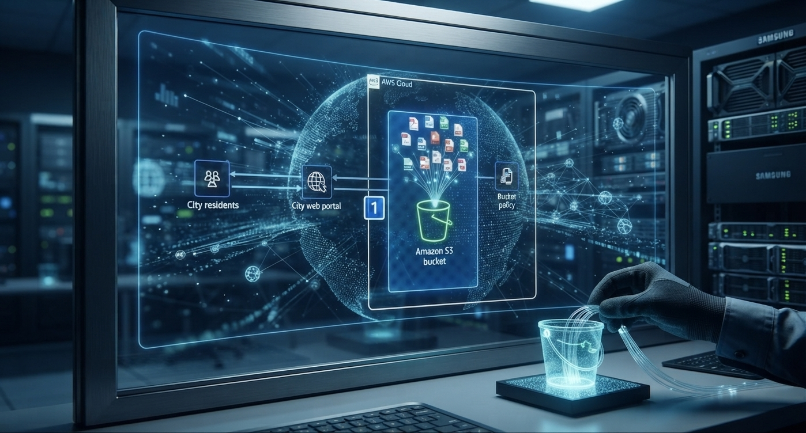

## Minha-Jornada-Pratica-na-Nuvem-AWS
"Do AWS re/Start ao console da AWS: documentando cada clique, cada erro e cada vitória."

Aqui documento a união entre a base teórica e pratica do programa AWS re/Start em união hands-on dos laboratórios do AWS Skill Builder (trilha AWS SimuLearn — Cloud Computing Essentials). A ideia é simples: transformar conceitos em soluções reais, registrando o passo a passo, os desafios e as lições aprendidas em cada cenário.

## Índice dos Laboratórios SimuLearn.

| Etapa | Laboratório                                                   | Status      | Link                      |
| ----- | ------------------------------------------------------------- | ----------- | ------------------------- |
| 01    | **Fundamentos da computação em nuvem**                        | ✅ Concluído | [Ver detalhes](#etapa-01) |
| 02    | **Primeiros passos na nuvem**                                 | ✅ Concluído | [Ver detalhes](#etapa-02) |
| 03    | **Soluções de computação**                                    | ✅ Concluído | [Ver detalhes](#etapa-03) |
| 04    | **Primeiro banco de dados NoSQL**                             | ✅ Concluído | [Ver detalhes](#etapa-04) |
| 05    | **Conceitos de rede**                                         | ✅ Concluído | [Ver detalhes](#etapa-05) |
| 06    | **Economias na nuvem**                                        | ✅ Concluído | [Ver detalhes](#etapa-06) |
| 07    | **Sistemas de arquivos na nuvem**                             | ✅ Concluído | [Ver detalhes](#etapa-07) |
| 08    | **Banco de dados na prática**                                 | ✅ Concluído | [Ver detalhes](#etapa-08) |
| 09    | **Conceitos básicos de segurança**                            | ✅ Concluído | [Ver detalhes](#etapa-09) |
| 10    | **Aplicações de recuperação automática e com escalabilidade** | ✅ Concluído | [Ver detalhes](#etapa-10) |
| 11    | **Aplicativos web de alta disponibilidade**                   | ✅ Concluído | [Ver detalhes](#etapa-11) |
| 12    | **Conectando VPCs**                                           | ✅ Concluído | [Ver detalhes](#etapa-12) |

<table>
  <tr>
    <td align="center">
       
      <b>Dashboard da Etapa 1</b>
    </td>
    <td align="center">
       
      <b>Arquitetura S3 SimuLearn</b>
    </td>
  </tr>
</table>

## Etapa 01: Fundamentos da computação em nuvem

## O Problema
A cidade tinha um portal web de previsão de ondas que vive fora do ar porque os servidores locais (on-premises) não aguentavam o tráfego. Obter e configurar
novos recursos de hardware demorava meses.

## A Solução
Migrar o site estático para a nuvem usando o Amazon S3, aproveitando agilidade, redução de custos e alta disponibilidade.

## Arquitetura

  

## O que foi feito
Navegação pelo Console da AWS e localização do serviço Amazon S3. Compreensão do papel do S3 como armazenamento de objetos e hospedagem estática
Análise da arquitetura proposta no cenário do SimuLearn

## Aprendizados e Bastidores
"Achar o S3 no menu gigantesco do console foi quase um desafio por si só! Mas quando vi o diagrama da arquitetura fazendo sentido, deu aquele clique:
então É ASSIM que a nuvem funciona na prática!" O Amazon S3 é muito mais do que "armazenamento de arquivos" — é hospedagem, recuperação e entrega de dados num serviço só Na nuvem, você provisiona recursos em minutos, não em meses. Segurança é fundamental: o bucket policy garante controle de acesso.

